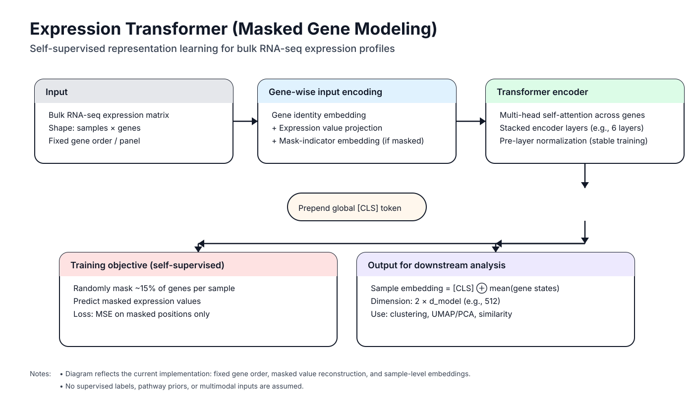

# Expression Transformer

### Masked Gene Modeling for Representation Learning in Gene Expression Data

This repository implements a **Transformer-based, self-supervised learning framework** for gene expression data using **Masked Gene Modeling (MGM)**. The approach is inspired by masked language modeling in BERT and is designed to learn biologically meaningful **sample-level embeddings** from bulk RNA-seq expression matrices.

The primary objective of the project is to learn **robust, unsupervised representations of gene expression profiles** that capture gene–gene dependencies and global transcriptional structure, enabling downstream tasks such as **clustering, subtype discovery, and comparative analysis across cancer cell lines and tumour samples**.

---

## Overview

The Expression Transformer treats genes as fixed-position tokens and uses self-attention to model their co-expression structure. During training, a subset of gene expression values is masked, and the model is optimized to reconstruct these masked values from the remaining context. This forces the model to learn structured dependencies between genes rather than memorizing marginal expression levels.

The learned representations are extracted as **hybrid embeddings**, combining a global summary token with aggregated gene-level information, and are intended for **unsupervised and exploratory analyses** rather than supervised prediction.

---

## Key Characteristics

* **Self-supervised training via Masked Gene Modeling (MGM)**
  Randomly masks a fraction of genes per sample and predicts their expression values.

* **Transformer encoder architecture**
  Multi-head self-attention captures higher-order gene–gene relationships across the entire expression profile.

* **Explicit mask-indicator embedding**
  Distinguishes masked zeros from biologically meaningful zero expression values.

* **Hybrid sample embeddings**
  Concatenation of a global `[CLS]` token and mean-pooled gene representations.

* **Strict gene-order validation**
  Ensures reproducibility and consistency across preprocessing, training, and inference.

* **GPU-only execution**
  Designed for efficient training and inference on modern GPU clusters.

---

## Scientific Motivation

Gene expression matrices are high-dimensional and structured, with strong dependencies between genes driven by pathways, regulatory programs, and cell identity. Classical methods often rely on predefined gene sets or linear projections.

This project adopts a **representation learning perspective**, in which:

* Each gene is treated as a token with a learned identity embedding.
* Expression values provide continuous input signals.
* Self-attention learns context-dependent relationships between genes.
* The resulting sample embeddings summarize transcriptional programs in a data-driven manner.

The framework is particularly suited for **unsupervised cancer subtype discovery**, **cell line–tumour alignment**, and **pan-cancer comparative analyses**, where labels may be available.

---

## Model Architecture



### Expression Transformer (`ExprTransformer`)

The model consists of the following components:

1. **Gene identity embeddings**
   A learnable embedding vector for each gene, representing gene-specific properties.

2. **Expression value projection**
   Scalar expression values are projected into the model's hidden dimension and combined additively with gene embeddings.

3. **Mask-indicator embedding**
   A learned vector added only at masked positions, enabling the model to distinguish masking from true zero expression.

4. **Global `[CLS]` token**
   Prepended to each sample to learn a dedicated global summary representation.

5. **Transformer encoder stack**
   A stack of multi-head self-attention layers (default: 6 layers, 8 heads) with pre-layer normalization.

6. **Output projection (training only)**
   Maps hidden states back to scalar expression values for reconstruction of masked genes.

---

## Embedding Strategy

For downstream analysis, the model produces **sample-level embeddings** by concatenating:

* The final hidden state of the `[CLS]` token (global context)
* The mean-pooled hidden states of all gene tokens (distributed signal)

With `d_model = 256`, this results in **512-dimensional embeddings** per sample.

These embeddings are intended for:

* Clustering and subtype discovery
* Dimensionality reduction (UMAP, PCA)
* Similarity-based comparisons between samples or cohorts

---

## Training Procedure

* **Masking**: 15% of genes are randomly masked per sample.
* **Objective**: Mean squared error (MSE) computed **only on masked positions**.
* **Optimizer**: AdamW (`lr = 3e-4`, `weight_decay = 0.01`).
* **Precision**: Mixed-precision (FP16) training with gradient scaling.
* **Batch size**: 256 (GPU-optimized).
* **Checkpoints**: Saved after every epoch with embedded gene-order hash.

Training is fully self-supervised and does not require phenotype or subtype labels.

---

## Installation

### Prerequisites

* Python 3.10+
* CUDA-capable GPU (required for training and inference)
* Conda or Miniconda

### Setup

1. Clone the repository:
```bash
git clone <repository-url>
cd dsmz/transformer/expr_transformer
```

2. Create and activate the conda environment:
```bash
conda env create -f envs/exprtf.yml
conda activate exprtf
```

3. Verify GPU availability:
```bash
python -c "import torch; print('CUDA available:', torch.cuda.is_available())"
```

---

## Quick Start

### 1. Prepare Data

Convert RDS files to NPZ format with z-score normalization:
```bash
python src/prep_rds_to_npz.py \
    --rds /path/to/expression_matrix.rds \
    --npz data/BRCA_HVG500_joint.npz \
    --meta data/BRCA_HVG500_joint.meta.json
```

### 2. Validate Gene Order

Verify data integrity and generate gene-order hash:
```bash
python src/check_gene_order.py
```

### 3. Train Model

Train the Masked Gene Model:
```bash
# On HPC cluster with SLURM
sbatch src/train_exprtf.sh

# Or directly (requires GPU)
python src/train_mgm.py
```

### 4. Generate Embeddings

Extract sample embeddings from trained model:
```bash
python src/export_embeddings.py \
    --ckpt ckpt/exprtf_brca_hvg500_ep30.pt \
    --out embeddings/BRCA_HVG500_joint_exprtf.tsv
```

---

## Project Structure

```
transformer/expr_transformer/
├── README.md                 # This file
├── envs/
│   └── exprtf.yml           # Conda environment specification
├── src/
│   ├── prep_rds_to_npz.py   # Convert RDS to NPZ format
│   ├── check_gene_order.py  # Validate gene order consistency
│   ├── train_mgm.py         # Train Masked Gene Model
│   ├── export_embeddings.py # Generate sample embeddings
│   └── train_exprtf.sh      # SLURM job script for HPC
├── data/                     # Input data directory
├── ckpt/                     # Model checkpoints
└── embeddings/               # Output embeddings
```

---

## Usage

### Data Preparation

**`prep_rds_to_npz.py`** - Converts RDS files to NPZ format with z-score normalization

```bash
python src/prep_rds_to_npz.py \
    --rds input.rds \
    --npz output.npz \
    --meta output.meta.json
```

**Arguments:**
* `--rds`: Input RDS file (required if USER env var not set)
* `--npz`: Output NPZ file path (default: `data/BRCA_HVG500_joint.npz`)
* `--meta`: Output metadata JSON path (default: `data/BRCA_HVG500_joint.meta.json`)

**Output:**
* NPZ file containing z-scored expression matrix (`X`), means (`mu`), and standard deviations (`sd`)
* JSON metadata file with sample IDs and gene names

### Gene Order Validation

**`check_gene_order.py`** - Validates NPZ and metadata consistency

```bash
python src/check_gene_order.py
```

**What it checks:**
* Matrix dimensions match metadata
* No duplicate genes
* Gene IDs are valid strings
* Generates SHA256 hash for future validation

### Training

**`train_mgm.py`** - Trains the Masked Gene Model

```bash
python src/train_mgm.py
```

**Training Process:**
1. Loads z-scored expression matrix
2. Randomly masks 15% of genes per sample
3. Trains model to predict masked values
4. Saves checkpoint after each epoch

**Output:**
* Checkpoint files: `ckpt/exprtf_brca_hvg500_ep{epoch:02d}.pt`
* Each checkpoint contains:
  * Model weights
  * Gene hash for validation
  * Architecture configuration

### Embedding Generation

**`export_embeddings.py`** - Generates sample embeddings

```bash
python src/export_embeddings.py \
    --npz data/BRCA_HVG500_joint.npz \
    --meta data/BRCA_HVG500_joint.meta.json \
    --ckpt ckpt/exprtf_brca_hvg500_ep30.pt \
    --out embeddings/embeddings.tsv
```

**Arguments:**
* `--npz`: Input NPZ file (default: `data/BRCA_HVG500_joint.npz`)
* `--meta`: Metadata JSON file (default: `data/BRCA_HVG500_joint.meta.json`)
* `--ckpt`: Model checkpoint path (default: `ckpt/exprtf_brca_hvg500_ep30.pt`)
* `--out`: Output TSV file (default: `embeddings/BRCA_HVG500_joint_exprtf.tsv`)
* `--batch-size`: Batch size for inference (default: 512)
* `--device`: Device selection (GPU-only, CPU not supported)

**Output:**
* TSV file with embeddings (samples × 512 dimensions)
* Each row is a sample, columns are embedding dimensions (z1, z2, ..., z512)

---

## Data Format

### Input: NPZ (expression matrix)

* `X`: Z-score–normalized expression matrix
  Shape: `(n_samples, n_genes)`, `float32`
* `mu`, `sd`: Per-gene mean and standard deviation (for inverse transform)

### Input: Metadata JSON

```json
{
  "samples": ["sample_1", "sample_2", "..."],
  "genes": ["ENSG00000141510", "ENSG00000171862", "..."]
}
```

### Output: Embeddings (TSV)

* Rows: Samples
* Columns: Embedding dimensions (`z1` … `z512`)

---

## Intended Use Cases

* Unsupervised clustering of cancer cell lines or tumour samples
* Subtype discovery without predefined labels
* Comparative analysis across datasets (e.g. cell lines vs TCGA tumours)
* Feature extraction for downstream statistical or machine learning analyses

---

## Reproducibility and Validation

The pipeline enforces strict validation of gene ordering via SHA256 hashes embedded in checkpoints. Any mismatch between training and inference gene order results in a hard failure, preventing silent data corruption.

---

## Troubleshooting

### CUDA Not Available

**Error**: `CUDA required. Submit this job to a GPU node`

**Solution**: Ensure you're running on a GPU node:
```bash
# Check GPU availability
nvidia-smi

# Submit to SLURM with GPU
sbatch --partition=gpu --gres=gpu:1 src/train_exprtf.sh
```

### Gene Order Mismatch

**Error**: `Gene ordering mismatch between checkpoint and metadata`

**Solution**: 
1. Verify data hasn't been reordered: `python src/check_gene_order.py`
2. Ensure using the same metadata file used during training
3. Check that gene hash in checkpoint matches metadata hash

### Checkpoint Missing Gene Hash

**Error**: `Checkpoint is missing 'gene_hash'`

**Solution**: Retrain the model with the updated code that includes gene hash validation.

### Memory Issues

**Error**: Out of memory (OOM) during training/inference

**Solution**:
* Reduce batch size: `--batch-size 128`
* Use gradient accumulation
* Process data in smaller chunks

